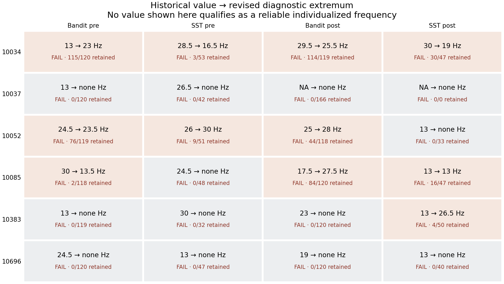

# Pilot rhythm validation report

**No individualized beta frequency survives the prespecified provisional QC gates.** This is a negative feasibility result for this workflow and dataset, not proof that participants lack beta rhythms or that Bandit and SST are equivalent.

The [QC summary](../validation/pilot_results/qc_summary.csv), [original/revised comparison](../validation/pilot_results/original_revised_comparison.csv), [paired descriptives](../validation/pilot_results/paired_descriptives.csv), per-trial logs, spectra, plots, input manifest, and configuration are committed under `validation/pilot_results`. The [audit](rhythm_estimation_audit.md) gives methods, evidence, threshold rationale, and PI decisions. The [Avi guide](avi_rhythm_validation_guide.md) gives executable Windows commands.

## Coverage and result

- 38 pilot EEG recordings inventoried across ten directories; 28 have explicit behavioral matches, and 10 remain unmatched/unverifiable. Recordings with only an LSL event clock and no Unix bridge are not aligned by guessing.
- 95 requested analyses: 38 response-beta ERD, 19 feedback-theta, 19 successful-stop beta, and 19 failed-stop beta. Every entry has a result or a specific failure; **0 pass**.
- For response beta, 14 recordings retain at least one trial; five retain at least 40. Four meet both the 40-trial and 60%-retention gates. Even those four fail localization/corroboration or stability. The count failure is not the only explanation for the negative result.
- No reliable cross-task pairs or pre/post pairs remain. A corrected correlation or inferential test would have no evidential basis. Pre/post also spans stimulation and is not a pure repeatability test.
- The six participants in Avi's comparison have 24 EEG recordings and reviewed event-file matches. The two 10037 post recordings have events outside the pilot subfolder, but the historical fixture has no estimates there. They fail corrected event QC and are not manufactured as missing historical values.

## Historical reproduction

All **11/11 available Bandit fixture values** reproduce exactly using the committed historical beta algorithm and actual input files. Its 10034 pre value is 13 Hz with +0.008774 dB; numerical minimization did not demonstrate suppression. The fixture contains 11 boundary values among 22 supplied frequencies. The median absolute historical Bandit–SST difference is 10 Hz over 11 matched recording pairs; these include unreliable boundary results and should not be interpreted biologically.

No committed implementation generating the expanded SST values was found. Two documented response-locked adaptations were attempted: all responses, and correct go responses only, otherwise preserving the historical preprocessing/windows. They reproduce only **4/11** and **5/11** supplied SST values respectively. Partial matches, especially 13/30-Hz boundaries, do not establish provenance. Neither adaptation is labeled the original SST method. Per-recording `legacy_reproduction.json` records both values, trial counts, and the explicit limitation. Historical reports/data were not overwritten.

## Six-participant response-beta comparison

Every revised number below is a **failed diagnostic extremum**, not a reliable candidate or a stimulation frequency. A dash means no spectrum could be estimated after validity/QC exclusions. Counts include selected trials with missing timestamps in the denominator. “Original” is the supplied historical fixture, not a validation target.

| Subject | Task | Phase | Original Hz | Revised diagnostic Hz | Effect dB | Retained / eligible | Principal limitations |
|---|---|---|---:|---:|---:|---:|---|

| 10034 | bandit | pre | 13 | 23 | -0.753 | 115 / 120 | no localized feature; no absolute corroboration; unstable/missing resampled feature |
| 10034 | sst | pre | 28.5 | 16.5 | -7.248 | 3 / 53 | too few trials; low retention/artifacts; no absolute corroboration; unstable/missing resampled feature |
| 10034 | bandit | post | 29.5 | 25.5 | -0.919 | 114 / 119 | no localized feature; unstable/missing resampled feature |
| 10034 | sst | post | 30 | 19 | -0.446 | 30 / 47 | too few trials; no localized feature; unstable/missing resampled feature |
| 10037 | bandit | pre | 13 | — | — | 0 / 120 | clock inconsistency |
| 10037 | sst | pre | 26.5 | — | — | 0 / 42 | event overlap |
| 10037 | bandit | post | — | — | — | 0 / 166 | event overlap |
| 10037 | sst | post | — | — | — | 0 / 0 | no correct go events |
| 10052 | bandit | pre | 24.5 | 23.5 | -1.428 | 76 / 119 | no localized feature; no absolute corroboration; unstable/missing resampled feature |
| 10052 | sst | pre | 26 | 30 | -2.380 | 9 / 51 | too few trials; low retention/artifacts; boundary; no localized feature; unstable/missing resampled feature |
| 10052 | bandit | post | 25 | 28 | -0.985 | 44 / 118 | low retention/artifacts; no localized feature; unstable/missing resampled feature |
| 10052 | sst | post | 13 | — | — | 0 / 33 | insufficient good ROI; too few trials; low retention/artifacts; unstable/missing resampled feature |
| 10085 | bandit | pre | 30 | 13.5 | -0.514 | 2 / 118 | too few trials; low retention/artifacts; no localized feature; unstable/missing resampled feature |
| 10085 | sst | pre | 24.5 | — | — | 0 / 48 | insufficient good ROI; too few trials; low retention/artifacts; unstable/missing resampled feature |
| 10085 | bandit | post | 17.5 | 27.5 | -1.222 | 84 / 120 | no localized feature; no absolute corroboration; unstable/missing resampled feature |
| 10085 | sst | post | 13 | 13 | -2.280 | 16 / 47 | too few trials; low retention/artifacts; boundary; no localized feature; no absolute corroboration; unstable/missing resampled feature |
| 10383 | bandit | pre | 13 | — | — | 0 / 119 | too few trials; low retention/artifacts; unstable/missing resampled feature |
| 10383 | sst | pre | 30 | — | — | 0 / 32 | event overlap |
| 10383 | bandit | post | 23 | — | — | 0 / 120 | too few trials; low retention/artifacts; unstable/missing resampled feature |
| 10383 | sst | post | 13 | 26.5 | -1.225 | 4 / 50 | too few trials; low retention/artifacts; unstable/missing resampled feature |
| 10696 | bandit | pre | 24.5 | — | — | 0 / 120 | too few trials; low retention/artifacts; unstable/missing resampled feature |
| 10696 | sst | pre | 13 | — | — | 0 / 47 | too few trials; low retention/artifacts; unstable/missing resampled feature |
| 10696 | bandit | post | 19 | — | — | 0 / 120 | too few trials; low retention/artifacts; unstable/missing resampled feature |
| 10696 | sst | post | 13 | — | — | 0 / 40 | too few trials; low retention/artifacts; unstable/missing resampled feature |

## Reading the negative result

10034 Bandit pre retains 115/120 trials yet its ~23-Hz contrast trough has no qualifying localized prominence or absolute spectral corroboration. The original 13-Hz boundary result becomes a different diagnostic extremum when the estimand, reference, and edge treatment are corrected; neither is reliable. Good trial retention alone is insufficient.

SST data are more limited: correct-go selection reduces the available sample and artifact screening removes many remaining trials. Stop-success and stop-failure subgroups are small and often extend beyond the EEG recording; none supports a qualified individualized enhancement frequency. The onset-based analysis does not estimate beta-burst rate or establish inhibition specificity.

Fp1 is frequently contaminated. Excluding it from the reference avoids injecting that activity into every channel, but epochs still fail when contamination correlates with the referenced frontal ROI. For example, 10696 retains no qualified response epochs under these screens. These are conservative operational exclusions, not proof that every rejected segment contains no neural information. More permissive thresholds were not used to chase agreement.

10037 pre has marked Unix/LSL inconsistency, and its SST correct-go overlap is also insufficient. Its post SST file has no correct-go responses; post Bandit has insufficient overlap. The software records measured timing diagnostics and does not repair clocks by shifting recording starts. Input/source gaps for other pilot directories remain visible in the 38-recording CSV rather than disappearing from the denominator.

**The apparent task discrepancy cannot be evaluated among reliable estimates because none survive.** It is not defensible to claim that task differences remain, vanish, or correlate across participants. The historical discrepancy is strongly confounded by estimand differences, endpoint selection, data alignment, and low/contaminated trial counts.

## Theta, limitations, and handoff

No feedback-theta TFR estimate passes the primary reliability framework. Separate descriptive Specparam fits sometimes identify theta (e.g., 10052 pre), and separate IAF−5 values are retained without clipping, but these methods do not estimate the same phenomenon and have not been promoted to stimulation recommendations. Some modeled values arise from too few clean trials to validate; see their retained counts, not just the fitted frequency.

The analysis does not establish hardware synchronization, calibrate QC thresholds on an independent cohort, estimate test–retest reliability without stimulation, or validate sparse frontal signals as motor-cortex frequencies. Absolute spectral corroboration is a slope-removal screen rather than a full oscillation/aperiodic generative model. Trial bootstrap intervals do not account for all reference, baseline-context, or spectral-resolution uncertainty. These limitations remain even for synthetic tests that recover the known signals correctly.

No `.neprot`, historical report, participant data, acquisition timing, or counterbalancing file was modified. A dry-run recommendation is emitted for each analysis and cannot be consumed by the live JSON selector. PI decisions are limited to future scientific/deployment choices listed in the audit; Avi's task is to run the tests, inspect the three diagnostics, and report computer-specific discrepancies.
